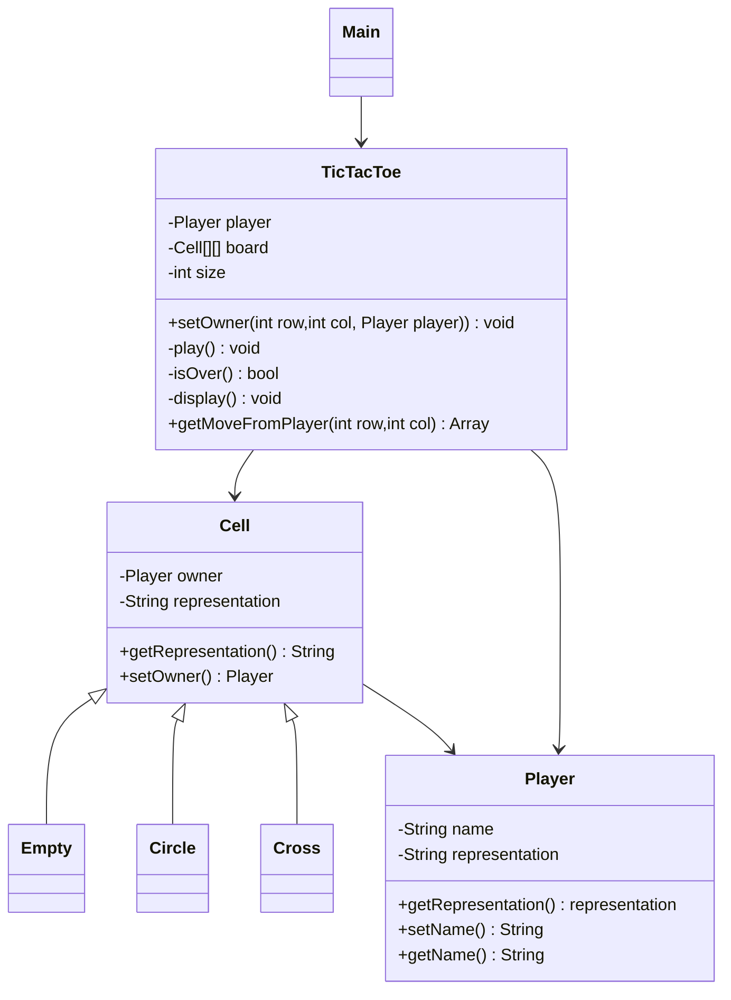

# TicTacToe
TicTacToe projet using Java

## Class diagram

```mermaid
classDiagram
direction TB
    class Empty {
    }
    class Cross {
    }
    class Circle {
    }
    class TicTacToe {
	    -Player player
	    -Cell[][] board
	    -int size
	    +setOwner(int row,int col, Player player)) void
	    -play() void
	    -isOver() bool
	    -display() void
	    +getMoveFromPlayer(int row,int col) Array
    }
    class Player {
	    -String name
	    -String representation
	    +getRepresentation() representation
	    +setName() String
	    +getName() String
    }
    class Cell {
	    -Player owner
	    -String representation
	    +getRepresentation() String
	    +setOwner() Player
    }

    class Main{
    }

    Cell <|-- Empty
    Cell <|-- Circle
    Cell <|-- Cross
    Cell --> Player
    TicTacToe --> Cell
    TicTacToe --> Player
    Main --> TicTacToe
```
